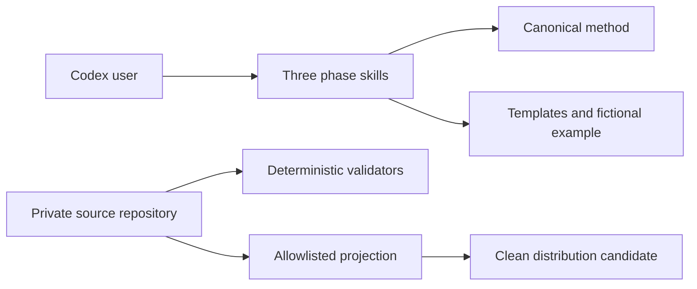

# Architecture

Intent to Release is a passive, skills-only Codex plugin plus private source-side
validation and publication controls. Design history belongs in linked issues and
ADRs; this document describes the shipped contract.

## Purpose And Scope

The product guides software changes through Product Discovery, Solution Design,
and Change Delivery. Product authority makes exactly two product decisions;
contributors, maintainers, independent acceptors, and release operators enforce
quality and promotion controls.

## System Context

The installed boundary contains only passive Markdown and JSON. Publication
controls remain in the private source repository and are not projected.

## Components And Boundaries

| Component | Responsibility | Owns | Depends on |
|---|---|---|---|
| Phase skills | Route a request into one lifecycle phase | Trigger boundaries and phase procedure | Canonical method |
| Canonical method | Define roles, artifacts, gates, reconciliation, acceptance, release | Normative lifecycle contract | None |
| Templates/example | Provide portable starting artifacts and orientation | Non-normative derivatives | Canonical method |
| Public validation | Validate package, links, passive boundary, manifest, and public tests | Public product evidence | Python, shell, Git |

## Data And State

There is no runtime data store or background work. Repository artifacts own
intent, temporary design, implementation evidence, durable shipped knowledge,
acceptance, and release as defined by the method.

## External Services

The plugin requires none. Official creator validators are development-only and
run with an ephemeral PyYAML environment.

## Deployment Boundaries

The public repository is one clean, single-root distribution containing the
plugin and its self-contained validation/documentation surface. Private release
provenance and target controls are intentionally absent.

## Capability Architecture

| Capability | Documentation |
|---|---|
| Intent-to-release lifecycle | `docs/architecture/intent-to-release.md` |

## Decisions And Tradeoffs

- `docs/decisions/0001-skills-only-lifecycle-plugin.md`
